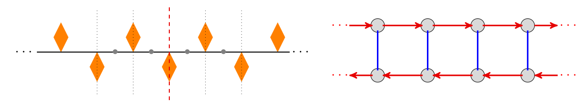

# frieze-groups

This repository contains a simple CLI written in Python for exploring different frieze groups visually using ascii art.

The code follows the ideas from a beautiful introduction to Visual Group Theory by Prof. M. Macauley.

We have implemented only one of the frieze patterns yet. Let $g$ be a glide-reflection to the right, and $h$ a horizontal flip about the element in the middle of the given sequence. This corresponds to the following pattern (on the left) and its Cayley graph (on the right).

We might implement the other six groups as well in the future (most likely we won't :P).

### References

1. M. Macauley. *Modern Algebra*. In *Math 4120/6120*, 2019. URL: http://www.math.clemson.edu/~macaule/classes/f21_math4120/ (accessed: 07.01.2022).